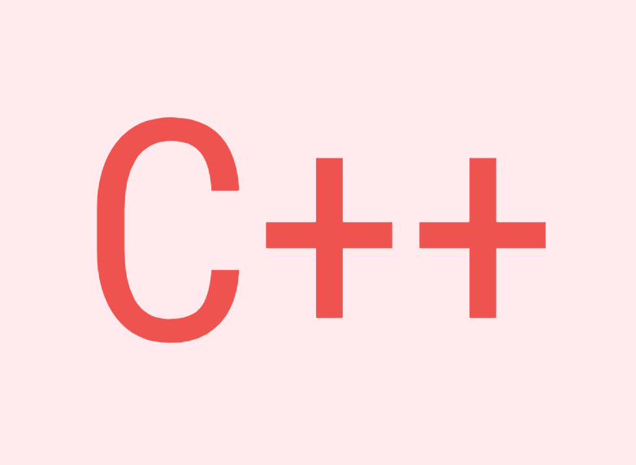

# Програмирање со C++

Часови по програмирање со C++ програмски јазик.

https://ivohost.com

## ДЕЛ 1

- Вовед - Introduction 
- Програм - Program
- Коментари - Comments
- Податоци - Data
- Константи - Constants
- Променливи - Variables
- Оператори - Operators
- Услови - Conditionals
- Повторување - Iteration
- Исклучоци - Exceptions
- Функции - Functions

## ДЕЛ 2

- Референци - References
- Покажувачи - Pointers
- Меморија - Memory
- Низи - Arrays
- Текст - String
- Набројувања - Enumerations
- Структури - Structures
- Унии - Unions
- Класи - Classes

## ДЕЛ 3

- Шаблони - Templates
- Простори - Namespaces
- Прецесор - Preprocessor
- Заглавја - Headers
- Компилација - Compilation Units
- Библиотека - Library

